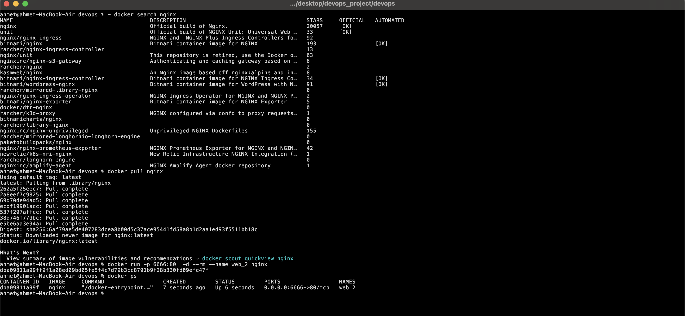

1-DevOps kültürü:Yazılım geliştirme ve dağıtım süreçlerini belli kurallar çerçevesinde gerçekleştirmemizi sağlayan bu süreçleri otomatize edip birbirine bağlayan kültürdü Dev => Development yani geliştirme aşamasını temsil ederken Ops => Operations ise ürünün yayınlanması kullanıma alınması ve kullanılırken durumunun izlenmesi gibi süreçleri ifade eder.
2- DevOps, "Development" (Geliştirme) ve "Operations" (Operasyonlar) kelimelerinin birleşiminden oluşan bir terimdir.
3- CI/CD ürünün sürekli olarak entegrasyonu Continous Integration ile temsil edilir(CI).CI aşamasında ürünümüzü geliştirirken main bir branchimiz vardır bu branch bizim yaptığımız değişiklikleri test edip (ekip arkadaşlarımız tarafından yapılan code reviewler yada çalıştırdığımız testler ) testlerden sonrasında bu ana branchimize aldığımız ve geliştirme kodumuzun branchmizin korunduğu aşamadır.Bu şekilde main branchimizi koruyarak daha güvenli bir geliştirme süreci geçiririz. CD yani Continous Delivery aşamasında ise yaptığımız değişikleri kolayca staggin/uat/test veya production gibi ortamlara kolayca release edilmesini sağlar.
4-DevOps Yöntemlerinden git nedir ? Git bir versiyon kontrol sistemidir.Git sayesinde ürünümüzü geliştirirken kolayca stateler arasında geçiş yapabilir bu sayede daha güvenli bir ürün geliştirme deneyimi yaşayabiliriz.
5-Agile Nedir ? Agile bir ürün geliştirme metodolojisidir bu metodolojiye göre ilk önce ürününün analizi yapılır ürünün sahip olması gereken fonksiyonlar belirlenmiş olur ardından herbir fonksiyon için planlama desing development , test ve review gibi aşamalar uygulanır.
6-Monitoring Nedir ? Monitoring (izleme), bir sistemin veya uygulamanın performansını, sağlığını ve işleyişini sürekli olarak gözlemleme ve değerlendirme sürecidir. Bu süreç, sorunları erken tespit etmek, performansı optimize etmek ve güvenilirliği sağlamak için kullanılır.Bazı zamanlarda uygulamamızın trafiği artabilir ve kilitlenme gibi tehlikelerle karşı karşıya kalabilir bu yüzden uygulamamızın sağlığını izlemek ve tedbirler almak önemlidir.
7-Xml (eXtensible Markup Language) : Veri depolamak ve taşımak için kullanılan insan tarafından okunabilen makine tarafından yorumlanan bir veri tipidir.
JSON (JavaScript Object Notation), veri değişimi ve depolama için kullanılan hafif, insan tarafından okunabilir bir veri formatıdır. JSON, JavaScript dilinden türetilmiştir ancak birçok programlama dili tarafından desteklenir.Günümüzde en popüler veri tiplerinden biridir rest apiler tarafından çoğunlukla kullanılan veri tipidir.
YAML (YAML Ain't Markup Language veya Yet Another Markup Language), insan tarafından okunabilir bir veri serileştirme formatıdır. YAML, veri yapılarını ve konfigürasyonları basit ve okunabilir bir şekilde tanımlamak için kullanılır.Girintiler Önemlidir. Http (Hyper Text Transfer Protocol) web üzerinde veri iletimi için kullanılan bir protokoldür.
HTTP, web tarayıcıları ve sunucuları arasındaki iletişimi yönetir ve web sayfalarının ve diğer kaynakların transferini sağlar.
Server:Bir server (sunucu), ağ üzerinde hizmet sağlayan bir bilgisayardır veya yazılımdır. Sunucular, çeşitli türdeki hizmetleri ve kaynakları kullanıcılar veya diğer bilgisayar sistemleriyle paylaşmak için kullanılır. Sunucular genellikle belirli bir işlevi yerine getirmek üzere yapılandırılmıştır ve istemciler (client) tarafından erişilir.
Java, yazılım geliştirme için kullanılan bir programlama dilidir ve Java ekosisteminde üç temel bileşen bulunur: JDK (Java Development Kit), JRE (Java Runtime Environment) ve JVM (Java Virtual Machine). Her biri, Java uygulamaları oluşturma ve çalıştırma sürecinde farklı bir rol oynar.
JVM (Java Virtual Machine): Java bytecode'u çalıştıran sanal makinedir. JRE (Java Runtime Environment): Java uygulamalarını çalıştırmak için gerekli ortamı sağlar ve JVM'i içerir.
JDK (Java Development Kit): Java uygulamaları geliştirmek için gerekli tüm araçları içerir, JRE'yi de içerir. Maven, Java projelerini yönetmek ve yapılandırmak için kullanılan bir proje yönetim aracıdır.
Maven, projelerin derleme, bağımlılık yönetimi, dağıtım ve raporlama gibi çeşitli aşamalarını otomatikleştirmek için geniş bir araç seti sağlar. Bağımlılık Yönetimi: Maven, projelerin ihtiyaç duyduğu kütüphaneleri ve bağımlılıkları merkezi bir şekilde yönetir. Projelerin pom.xml dosyasında belirtilen bağımlılıklar otomatik olarak indirilebilir ve projeye dahil edilebilir. clean:You are using the clean command, which will delete all previously compiled Java .class files and resources (like .properties) in your project. Your build will start from a clean slate. install:test & package your Java project and even install/copy your built .jar/.war file into your local Maven repository. mvn clean install ile cache temizlenir ve compile alınır projeden tamamen beklenen çıktının alınması sağlanır.
./mvn clean package -DskipTest => Bu komut nedir ? Bu kod testlerin çalıştırılmadan kaynak kodun compile edilip paketlenmesini (.jar ve ya .war tipinde) sağlar.

32.Docker Nedir? Docker containerları yönetmemizi sağlayan teknolojidir.Containerlar ise uygulamaları izole bir şekilde uygulama ve bağımlılıklarının bir arada bulunduğu şekilde paketlenmiş halidir. Bu şekilde platformdan bağımsız şekilde istenilen yerlerde çalıştırılabilir Container ===>> (Code Base) + Dependencies Docker Deamon: Docker CLI : Docker CLI, Docker ile etkileşim kurmak için kullanılan komut satırı aracıdır. Genellikle docker komutuyla başlatılır.

49-Datadog Monitoring nedir ?

50-Kanban nedir ?
Yalın üretim tekniklerinden birisidir ve üretim süreçlerini yönetmek için kullanılan görsel bir yöntemdir. Japonca kökenli "kanban" kelimesi, "göz" ve "işaret" anlamına gelir ve "görsel işaret" veya "görsel kart" olarak çevrilebilir. Kanban, iş akışını ve üretim sürecini görselleştirir, böylece hangi ürünlerin ne zaman ve ne miktarda üretildiğini kontrol eder. Çekme sistemiyle, iş süreçlerini ve projeleri daha verimli hale getirmek için kullanılan bu yöntem, işlerin düzenli ve verimli bir şekilde yönetilmesini sağlar.

51-Scrum ve Waterfall nedir ?

Scrum
Agile proje yönetim metodolojilerinden biridir. Kompleks yazılım süreçlerinin yönetilmesi için kullanılır. Bunu yaparken bütünü parçalayan; tekrara dayalı bir yöntem izler. Düzenli geri bildirim ve planlamalarla hedefe ulaşmayı sağlar. Bu anlamda ihtiyaca yönelik ve esnek bir yapısı vardır. Müşteri ihtiyacına göre şekillendiği için müşterinin geri bildirimine göre yapılanmayı sağlar. İletişim ve takım çalışması çok önemlidir.

Waterfall
Yazılım geliştirmede yaygın olarak kullanılan geleneksel bir proje yönetimi metodolojisidir. Bu yöntemde proje, sıralı bir dizi aşamadan oluşur ve her aşama tamamlandıktan sonra bir sonraki aşamaya geçilir. Adını, her bir aşamanın aşağıdakine "düştüğü" bir şelale metaforundan alır.
