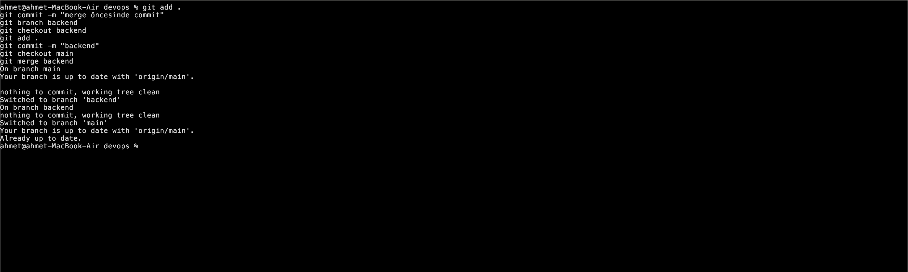
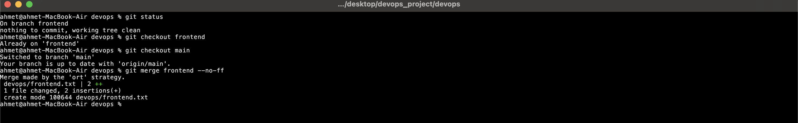

## Git Nedir?

Yazılım geliştirme projelerinde ürünün versiyonlarını takip etmek (herhangi bir t anındaki ürünün durumu (state)), değişiklikleri yönetmek ve işbirliği yapabilmek için kullanılır.

VCS: Version Control System

İyi bir commit amacına uygun çok fazla feature'ın bir arada bulunmadığı (birden fazla taski aynı commite koyduğumuzda tasklerden herhangi birini geri almak istediğimizde sorun
yaşayabiliriz), commit mesajının conventiona uygun olduğu ve commitin içeriğini özetlediğini dönüp bakıldığında yapılanlar hakkında soru işareti bırakmıyacak şekilde olmalıdır.

Staged Area & Unstaged Area Nedir?
Bir dosya üzerinde değişiklik yaptığımızda, bu dosya unstaged area'ya kaydedilir. Unstaged area, yapılan değişikliklerin henüz commit işlemine dahil edilmediği alandır. Değişiklik yapılan dosyaları seçip git add komutuyla staged area'ya ekleyebiliriz. Staged area'ya eklenen bu dosyalar, bir sonraki commit işlemine dahil edilir.Yani kısaca unstaged area değişiklik yapılan ama henüz commit işlemine dahil edilmeyen dosyaları içerirken unstaged areadan commit işlemine dahil edilen dosyalarsa staged area geçirilmiş olur.

Git GUI (Graphical User Interface) ve Git CLI (Command Line Interface), Git'i kullanmak için iki farklı interfacedir. Git GUI ile view componentleri kullanarak git fonksiyonlarını kullanabilmemizi sağlar örneğin vs codedaki git tab'i gibi bu tabi kullanarak branchleri yönetebilir ,commit atabilir pull, push ve benzeri işlemleri yapabiliriz. Git CLI ise git fonksiyonlarını komut satırından kullanmamızı sağlayan interfacedir.

Git Stash Nedir ? Localde yaptığımız değişiklikleri geçici olarak kaydedip projenin değişikliklerin henüz yapılmadığı haline gelmesini sağlayan fonksiyondur.Henüz commit yapmaya hazır değilsek yada denemeler yapıp denemelerimizin kaybolmasını istemiyorsak ve bu denemeleri commitlemek istemiyorsak stash fonksiyonunu kullanabiliriz.
